# Addendum: Experiments with  the Hartigan-Wong Algorithm

In the breathing *k*-means [preprint](https://arxiv.org/abs/2006.15666v3), we stated w.r.t. experiments with the Hartigan-Wong algorithm that *the results indicated
very clearly that, at least for these data sets, the Hartigan-Wong algorithm did not produce
results competitive with *k*-means++, even less so with breathing *k*-means*.

There have been questions from readers regarding these statements since they seem to contradict the results of [Telgarsky and Vattani (2010) ](http://proceedings.mlr.press/v9/telgarsky10a/telgarsky10a.pdf)  who reported superior results for the Hartigan-Wong Algorithm over Lloyd's algorithm (however, in an online variant) both with random and *k*-means++ initialization.

Therefore, we complemented the experiments described in the preprint by corresponding experiments with the Hartigan-Wong Algorithm in the widely-used [implementation provided by the R language in the stats package](https://www.rdocumentation.org/packages/stats/versions/3.6.2/topics/kmeans). In the stats package of R, the Hartigan-Wong algorithm is the default for solving *k*-means problems. One of the data sets used in the experiments, Cloud, has also been used by Telgarsky and Vattani (2010).
## Overall Result (TL;DR)
The assessment in the preprint was fully confirmed: The observed solution quality of Hartigan-Wong for the investigated problems was (with very few and marginal exceptions) clearly inferior to *k*-means++ (and even more so to breathing *k*-means). In many cases, Hartigan-Wong produced solutions with dramatically higher error values. Moreover, the implementation from the R language and environment employed for the experiments failed to deliver a valid solution in many experiments. For some problems, all runs failed, preventing a comparison to the other algorithms. 

## Experiments
For each problem, we performed several runs of Hartigan-Wong: 100 runs each for the 20 two-dimensional problems and 25 runs each for the high-dimensional problems. One run consisted of the following R-call:

```R
kmeans( X,
        centers = k,
        iter.max = 100,
        nstart = 10,
        algorithm = "Hartigan-Wong")
```

The number ```iter.max = 100``` of iterations was generally sufficient for all problems (only very occasional and only for very few problems runs did not converge within this number of iterations). The parameter ```nstart = 10``` specifies that, for each run, the Hartigan-Wong algorithm is to be performed ten times before the best result is chosen. The same value is used per default in ```scikit-learn``` for *k*-means++ (and was used in the preprint for all *k*-means++ experiments).

The tables below correspond to tables 4 to 8 in the preprint and have the following additional columns related to Hartigan-Wong (colored):

* 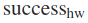 - the number of successful runs of Hartigan-Wong<br>This had to be added because in several cases, the Hartigan-Wong Algorithm aborted with the error message ```<simpleWarning: Quick-TRANSfer stage steps exceeded maximum (= 5000000)>```. The occurrence of this message seemed to depend on the *k*-means problem. For the 2D-Problems, this occurred most often for the problem "Birch1#100", where only 23 of 100 runs succeeded. Among the high-dimensional problems, particularly those based on the "Intrusion" data set, seemed nearly unsolvable by Hartigan-Wong. The SSE statistics shown were taken from the successful runs. The above problem has been known for a long time (here is a [stackoverflow post from 2014](https://stackoverflow.com/questions/21382681/kmeans-quick-transfer-stage-steps-exceeded-maximum)) but no solution seems to exist so far. The recommendations are often to use a different algorithm or to increase the number of repetitions.
* 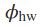 - the SSE of the Hartigan-Wong solution
* 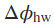 - the percentage error improvent of Hartigan-Wong over *k*-means++ defined as $\Delta\phi_{hw} = 1 - \phi_{hw}/\phi_{km++}$ (negative values indicate deteriorations)
* 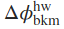 - the percentage error improvent of "breathing *k*-means" over Hartigan-Wong defined as $\Delta\phi^{hw}_{bkm} = 1 - \phi_{bkm}/\phi_{hw}$ 

As described in the [preprint on page 20](https://arxiv.org/pdf/2006.15666.pdf#page=20), the column $\Delta\phi_{bkm}$ contains the relative SSE improvement of "Breathing *k*-means" over *k*-means++ defined as $\Delta\phi_{bkm} = 1 - \phi_{bkm}/\phi_{km++}$. In the preprint this was denoted simply as 
$\Delta\phi$ since no other algorithm was compared to *k*-means++.

### Two-dimensional Data Sets
For these problems, the average solutions from Hartigan-Wong were inferior to those from *k*-means++ (see table below) apart from two problems,"Aggregation#200" and "Flame#80". Breathing *k*-means produced for all problems better average solutions (green column) than Hartigan-Wong and *k*-means++.
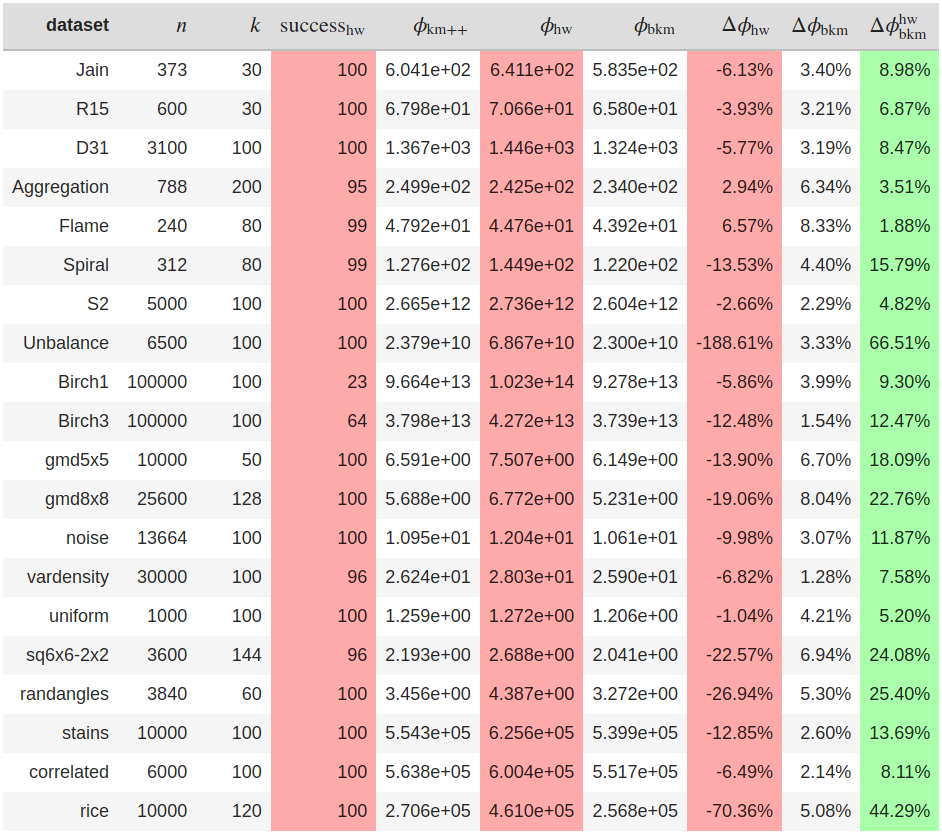


Below is a typical result for the problem "gmd5x5". Each good solution for this problem needs to have exactly two centroids in each cluster. This is violated by Hartigan-Wong, which positioned one, three, and in one case even four centroids in particular clusters. On average, the Hartigan-Wong solutions for this problem were 13.9 percent worse than those from *k*-means++. The solutions of breathing *k*-means were about 18% better than those of Hartigan-Wong.
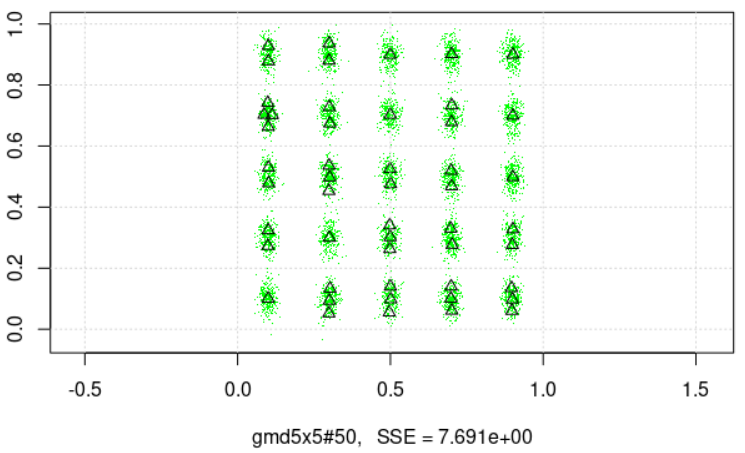
### High-dimensional Data Sets

For the Cloud data set, the solutions from Hartigan-Wong were consistently inferior by two-digit percentages.
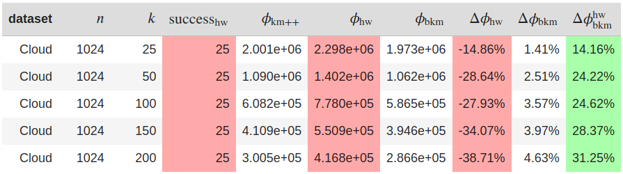

For the Norm25-new data set, the results were special. For the seemingly trivial case *k=25* (where both *k*-means++ and breathing *k*-means practically always found the obvious solution with one centroid per cluster), Hartigan-Wong found mostly poor solutions with huge error values. Also, for *k=50*, Hartigan-Wong could not find competitive solutions. However, for *k in {100,150,200}* better average solutions were found than by *k*-means++ and for *k in {150,200}* the Hartigan-Wong solutions were even slightly better than those found by breathing *k*-means
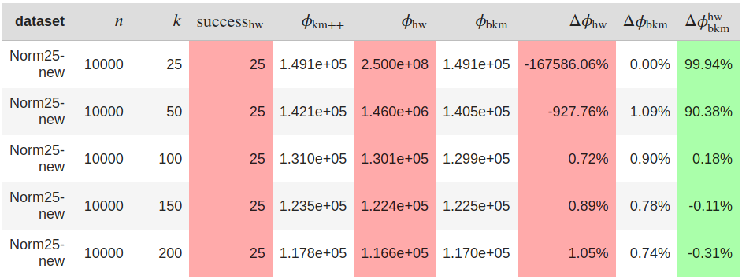

The example below helps to understand the enormous difference in SSE between Hartigan-Wong and the other two algorithms for problem Norm25-new#25. Since one can visually distinguish only 20 of 25 centroids (the triangles), probably 5 clusters have two associated centroids. Therefore some of the other centroids are positioned in the center of gravity of several clusters, which causes the immense SSE. Both *k*-means++ and breathing *k*-means position one centroid in each cluster for this problem and, therefore, have the same SSE values (three orders of magnitude smaller than Hartigan-Wong).
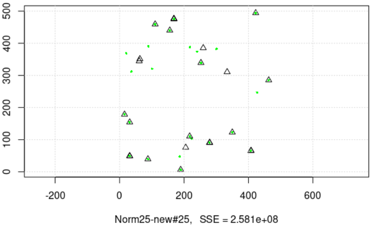

The Intrusion data set was the hardest one for the used Hartigan-Wong implementation of the R package. Only for *k=25* was a solution found. All runs with *k in {50,100,150,200}* stopped with the message

```
simpleWarning: Quick-TRANSfer stage steps exceeded maximum (= 5000000)
```
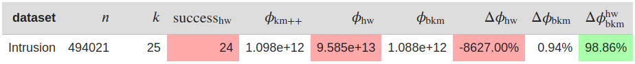

For the Spam data set, the solutions from Hartigan Wong were extremely poor. In a few runs for *k=25*, the algorithm failed.
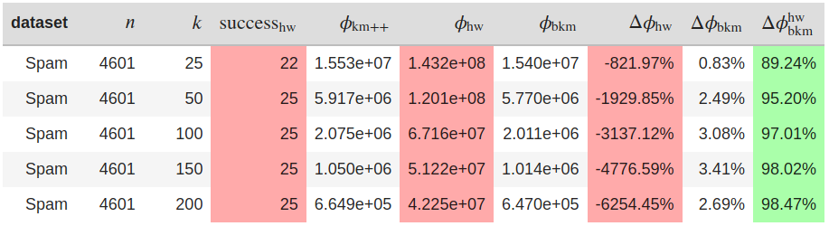

## CPU time 
While we do not make an effort to report detailed CPU usage for Hartigan-Wong, the implementation ran very fast using - in particular for smaller problems- significantly less CPU time than the other two algorithms. However, due to the observed quality of the solutions, the algorithm probably does not hit a "sweet spot" on the CPU time/SSE plane. Other algorithms should provide better solutions (or guaranteed solutions at all) in the given CPU time.

## R code used for the experiments

- [R notebook](./hartigan_experiments.Rmd) (to be run in RStudio) ([html preview](https://htmlpreview.github.io/?https://github.com/gittar/breathing-k-means/blob/master/HartiganWong/hartigan_experiments.nb.html))

## Concluding Remarks

Given that Hartigan-Wong is the default *k*-means algorithm in the R programming environment and, therefore, very widely used, it was completely unexpected that it frequently produced very poor solutions and even failed in a considerable number of cases. However, apart from increasing the number of runs (parameter ```nstart```) to much larger values than 10, an expensive brute-force strategy, we currently see no way to improve the results.
