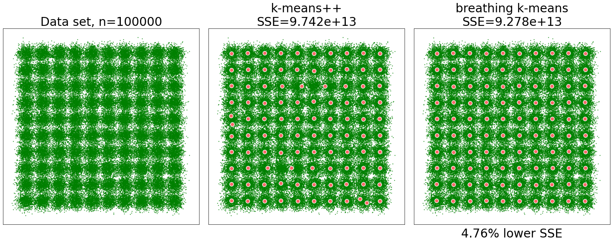

# The Breathing *K*-Means Algorithm (with examples)

The Breathing *K*-Means is an approximation algorithm for the *k*-means problem that (on average) is **better** (higher solution quality) and **faster** (lower CPU time usage) than  ***k*-means++**. 

**Techreport:**
https://arxiv.org/abs/2006.15666 (submitted for publication)

Typical results for the "Birch" data set (100000 points drawn from a mixture of 100 circular Gaussians). *k*=100

<p align="center">Can you spot the mistakes? :-)</p>

## Installation from pypi
```
pip install bkmeans
```
## Local installation to run the examples
Clone the repository

```shell
git clone https://github.com/gittar/breathing-k-means
```
Enter the top directory.

```shell
cd breathing-k-means
```
Create the conda environment 'bkm' (or any other name) via

```shell
conda env create -n bkm -f environment.yml
```
Activate the created environment via

```shell
conda activate bkm
```

 To run a jupyter notebook with examples, type, e.g.:

```shell
jupyter lab notebooks/2D.ipynb
```

## Content
The top level folder contains the following subfolders
* data/ - data sets used in the notebooks
* notebooks/ - jupyter notebooks with all examples from the [technical report](https://arxiv.org/abs/2006.15666)
  * [2D.ipynb](notebooks/2D.ipynb) 2D problems executed with helper functions for brevity
  * [2D_detail.ipynb](notebooks/2D_detail.ipynb) 2D problems executed with raw API
  * [10+D.ipynb](notebooks/10+D.ipynb) high-dimensional problems based on the data sets from the [original *k*-means++ publication](https://theory.stanford.edu/~sergei/papers/kMeansPP-soda.pdf)

* src/  
  * ``bkmeans.py`` - reference implementation of breathing k-means
* misc/
  * `aux.py` - auxiliary functions
  * `dataset.py` - general class to administer and plot data sets
  * `runfunctions.py`  - wrapper functions used in the notebook

## API

The included class **BKMeans** is subclassed from [scikit-learn's **KMeans** class](https://scikit-learn.org/stable/modules/generated/sklearn.cluster.KMeans.html)
and has, therefore, **the same API**. It can be used as a plug-in replacement for scikit-learn's **KMeans**. 

There is one new parameters which can be ignored (left at default) for normal usage:

* *m* (breathing depth), default: 5

The parameter *m* can also be used, however, to generate faster ( 1 < *m* < 5) or better (*m*>5) solutions. For details see the [technical report](https://arxiv.org/abs/2006.15666).

## Example 1: running on simple random data set
Code:
```python
import numpy as np
from bkmeans import BKMeans

# generate random data set
X=np.random.rand(1000,2)

# create BKMeans instance
bkm = BKMeans(n_clusters=100)

# run the algorithm
bkm.fit(X)

# print SSE (inertia in scikit-learn terms)
print(bkm.inertia_)
```
Output:
```
1.1775040547902602
```

## Example 2: comparison with *k*-means++ (multiple runs)
Code:
```python
import numpy as np
from sklearn.cluster import KMeans
from bkmeans import BKMeans

# random 2D data set
X=np.random.rand(1000,2)

# number of centroids
k=100

for i in range(5):
    # kmeans++
    km = KMeans(n_clusters=k)
    km.fit(X)

    # breathing k-means
    bkm = BKMeans(n_clusters=k)
    bkm.fit(X)

    # relative SSE improvement of bkm over km++
    imp = 1 - bkm.inertia_/km.inertia_
    print(f"SSE improvement over k-means++: {imp:.2%}")
```
Output:

```
SSE improvement over k-means++: 3.38%
SSE improvement over k-means++: 4.16%
SSE improvement over k-means++: 6.14%
SSE improvement over k-means++: 6.79%
SSE improvement over k-means++: 4.76%
```

## Acknowledgements
Kudos go the [scikit-learn](https://scikit-learn.org/) team  for their excellent  [sklearn.cluster.KMeans](https://scikit-learn.org/stable/modules/generated/sklearn.cluster.KMeans.html#sklearn.cluster.KMeans) class, also to the developers and maintainers of the other packages used: numpy, scipy, matplotlib, jupyterlab


