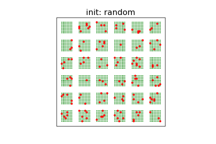

 

## Breathing *k*-means

This directory contains the reference implementation of "Breathing *k*-means" and supplementary material supporting a current conference submission (preprint: https://arxiv.org/abs/2006.15666)

### Installation using conda
Clone the repository, enter the top directory and then create the conda environment via

```
$ conda env create -f environment.yml
```
Activate the created environment via

```
$ conda activate bkmenv
```
### Solving a test problem

The file [src/bkm.py](src/bkm.py) contains the complete implementation of breathing k-means and can be directly executed:
```
$ python src/bkm.py
```
This makes a run on a built-in test problem comparing k-means++, breathing k-means with random init (the default), and breathing k-means with k-means++ init. Sample output:

```
k=100, data set: 10000 points drawn from mixture of 50 Gaussians in R^2 with cov=0.01^2*I2

algorithm         | init      | n_init | SSE                   | t
__________________|___________|________|_______________________|_______________________
k-means           | k-means++ | 10     | 1.2670                | 1.54s 
breathing k-means | random    |  1     | 1.2236 (3.42% better) | 3.12s (+103.28% overhead)
breathing k-means | k-means++ |  1     | 1.2239 (3.40% better) | 2.04s (+32.93% overhead)
```

### Jupter noteboook with examples

 For a number of examples please run the enclosed jupyter notebook [bkm.ipynb](notebooks/bkm.ipynb) (which makes use of [bkm.py](src/bkm.py))

```
$ jupyter lab notebooks/bkm.ipynb
```

### Content
The top level folder "supplement" contains the following sub folders
* data/ - (data sets used in the notebook)
* notebooks/ - (contains a jupyter notebook with examples)
* src/  
  * bkm.py - reference implementation of breathing k-means
  * aux.py - plotting functions
  * mydataset.py - general class to administer problem data sets
  * runfunctions.py  - wrapper functions used in the notebook

### Acknowledgements
Kudos go the [scikit-learn](https://scikit-learn.org/) team  which accelerated their [sklearn.cluster.KMeans](https://scikit-learn.org/stable/modules/generated/sklearn.cluster.KMeans.html#sklearn.cluster.KMeans) class immensely from  version 0.21.1 to 0.23.1. For this reason - instead of a GPU-based solution - we used sklearn.cluster.KMeans as base class in the breathing k-means reference implementation making it very compact and portable while requiring only a CPU. 

