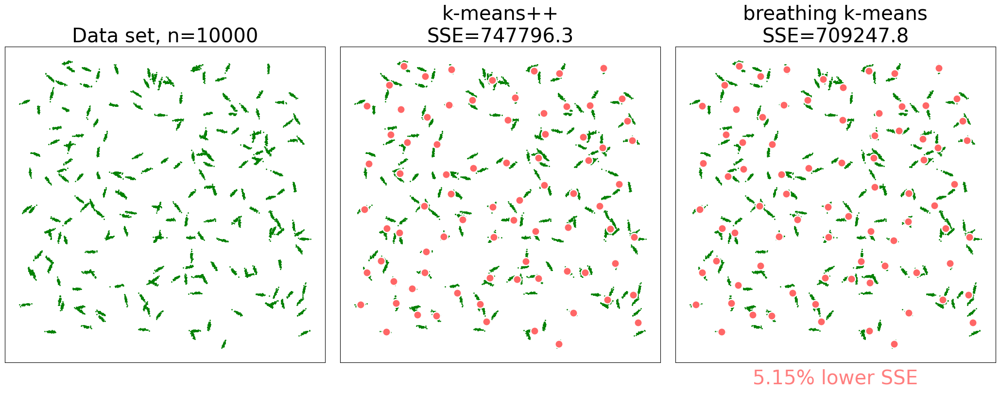

# Breathing *k*-means

This directory contains the reference implementation of "Breathing *k*-means", a new approximation algorithm for the *k*-means problem which typically improves significantly upon *k*-means++. For a full description see https://arxiv.org/abs/2006.15666 

Typical results for the "rice" data set (10000 points drawn from a mixture of 200 elongated 2D-Gaussians). $k$=80


[movie (animated gif)](./img/2D-examples.gif) with all 2D examples from https://arxiv.org/abs/2006.15666

## Installation from pypi
```
pip install bkmeans
```
## Local installation to run the examples
Clone the repository

```shell
git clone https://github.com/gittar/breathing-k-means
```
Enter the top directory.

```shell
cd bkmeans
```
 and then create the conda environment 'bkm' (or any other name) via

```shell
conda env create -n bkm -f environment.yml
```
Activate the created environment via

```shell
conda activate bkm
```

## Jupter noteboook

 For a number of examples please run any of the enclosed jupyter notebooks
 
 * [2D.ipynb](notebooks/2D.ipynb) 2D-problems from https://arxiv.org/abs/2006.15666 executed with helper functions for brevity
 * [2D_detail.ipynb](notebooks/2D_detail.ipynb) 2D-problems from https://arxiv.org/abs/2006.15666 executed with raw API
 * [10+D.ipynb](notebooks/10+D.ipynb) high-dimensional problems based on the data sets from the original *k*-means++ publication (https://theory.stanford.edu/~sergei/papers/kMeansPP-soda.pdf)

 To run, e.g. the first notebook, type:

```shell
$ jupyter lab notebooks/2D.ipynb
```

## Content
The top level folder contains the following sub folders
* data/ - (data sets used in the notebook)
* notebooks/ - (contains jupyter notebooks with examples)
* src/  
  * ``bkmeans.py`` - reference implementation of breathing k-means
* misc/
  * ``aux.py`` - auxiliary functions
  * `dataset.py` - general class to administer and plot data sets
  * `runfunctions.py`  - wrapper functions used in the notebook

## API

The BKMeans class is directly derived from scikit-learn's [KMeans](https://scikit-learn.org/stable/modules/generated/sklearn.cluster.KMeans.html#sklearn.cluster.KMeans) class class and thus has the same API, plus the following two new parameters with default values which normally can be left unchanged:
*  'm': default=5 ("breathing depth", i.e., the initial number of centroids to be added and removed during a breathe in/out cycle)
*  'theta': default=1.1 ("freezing range", i.e., relative neighborhood width to determine which centroids around a removed centroid are declared 'frozen')

Relevant inherited parameters (with default values) are:
*  'n\_clusters': default=8 (number of cluster centers, i.e., the *k* in *k*-means)
*  'init': default='k-means++' (method for initializing the centroids). Possible values are "k-means++", "random" or an array to be used as initial codebook.
*  'n\_init': default=10 (number of times the *k*-means algorithm will be run with different centroid seeds. The best result is taken as seeding for breathing *k*-means.)
*  'tol': default=0.0001 (relative tolerance wrt. Frobenius norm  of the difference in the cluster centers of two consecutive iterations to declare convergence, also used for breathing *k*-means)

## Example 1: running on simple random data set
Code:
```python
import numpy as np
from bkmeans import BKMeans

# generate random data set
X=np.random.rand(1000,2)

# create BKMeans instance
bkm = BKMeans(n_clusters=100)

# run the algorithm
bkm.fit(X)

# print SSE (inertia in scikit-learn terms)
print(bkm.inertia_)
```
Output:
```
1.1775040547902602
```

## Example 2: comparison with *k*-means++ (multiple runs)
Code:
```python
import numpy as np
from sklearn.cluster import KMeans
from bkmeans import BKMeans

# random 2D data set
X=np.random.rand(1000,2)

# number of centroids
k=100

for i in range(5):
    # kmeans++
    km = KMeans(n_clusters=k)
    km.fit(X)

    # breathing k-means
    bkm = BKMeans(n_clusters=k)
    bkm.fit(X)

    # relative SSE improvement of bkm over km++
    imp = 1 - bkm.inertia_/km.inertia_
    print(f"SSE improvement over k-means++: {imp:.2%}")
```
Output:

```
SSE improvement over k-means++: 3.38%
SSE improvement over k-means++: 4.16%
SSE improvement over k-means++: 6.14%
SSE improvement over k-means++: 6.79%
SSE improvement over k-means++: 4.76%
```

## Acknowledgements
Kudos go the [scikit-learn](https://scikit-learn.org/) team  for their excellent and efficient  [sklearn.cluster.KMeans](https://scikit-learn.org/stable/modules/generated/sklearn.cluster.KMeans.html#sklearn.cluster.KMeans) class, also to the developers and maintainers of the other packages used: scipy, matplotlib, jupyterlab


